## Boundary Gaussian Distance Loss

Paper: Boundary Gaussian Distance Loss Function for Enhancing Character Extraction from High-Resolution Scans of Ancient Metal-Type Printed Books 
 
DOI: https://doi.org/10.3390/electronics13101957 
 
To address the challenges of poor-quality raw data and imperfect GT labels, we propose a boundary-aware loss function based on Gaussian distance. 
The proposed loss function encourages the model to produce smooth and structurally consistent boundaries by comparing the boundary regions of the prediction and GT after Gaussian smoothing. 
 
Instead of directly computing pixel-wise distances between boundary points, the method approximate distance value through Gaussian-blurred boundary maps, which stabilizes training under noisy supervision and degraded document conditions.

## Challenge - Raw Data

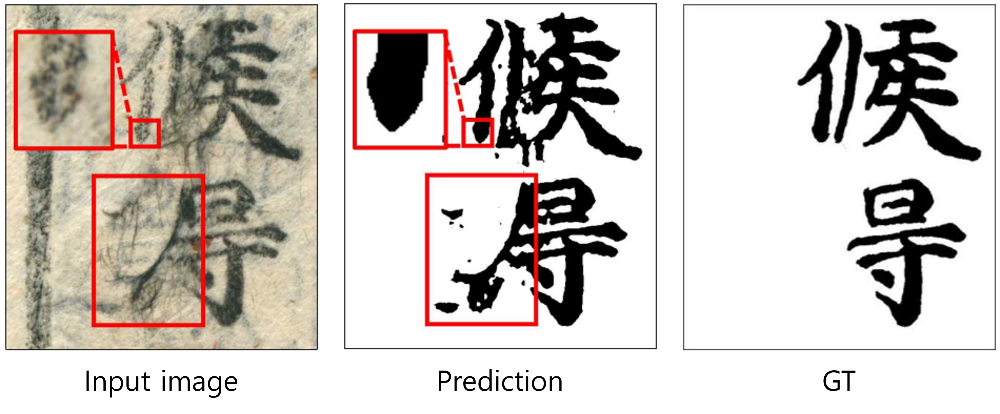
 
Unlike Gutenberg's printing, traditional Korean printing relied on manual pressing techniques using wooden sticks or cotton pads. 
As a result, the printing quality is often inconsistent, leading to various degradation patterns in scanned documents. 
 
Common defects include: 
 
● Holes inside characters caused by uneven ink distribution (a-upper) 
● Ink spreading or splashing outside character regions 
● Irregular strokes caused by ununiform printing pressure 
● Ink diffusion along paper fibers that were not fully processed during traditional paper manufacturing (a-lower) 
 
Due to these factors, character boundaries are often ambiguous, and existing segmentation networks struggle to effectively suppress noise such as broken strokes, internal holes, and background stains, resulting in unsatisfactory boundary quality.

## Challenge - Labeling

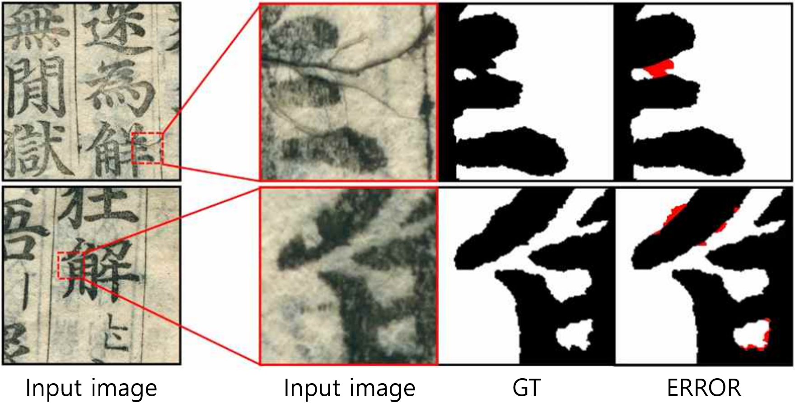
Low-quality printing also reduce the reliability of ground truth(GT).
Since GT masks are manually refined from model-generated pre-segmentation results, pixel-level inaccuracies are unavoidable, especially when dealing with high-resolution historical documents. 
 
In regions where the boundary between foreground and background is ambiguous, small labeling errors frequently remain, which introduces noise into the training process and limits the performance of boundary-sensitive segmentation models.

## Proposed Loss Function

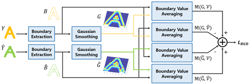
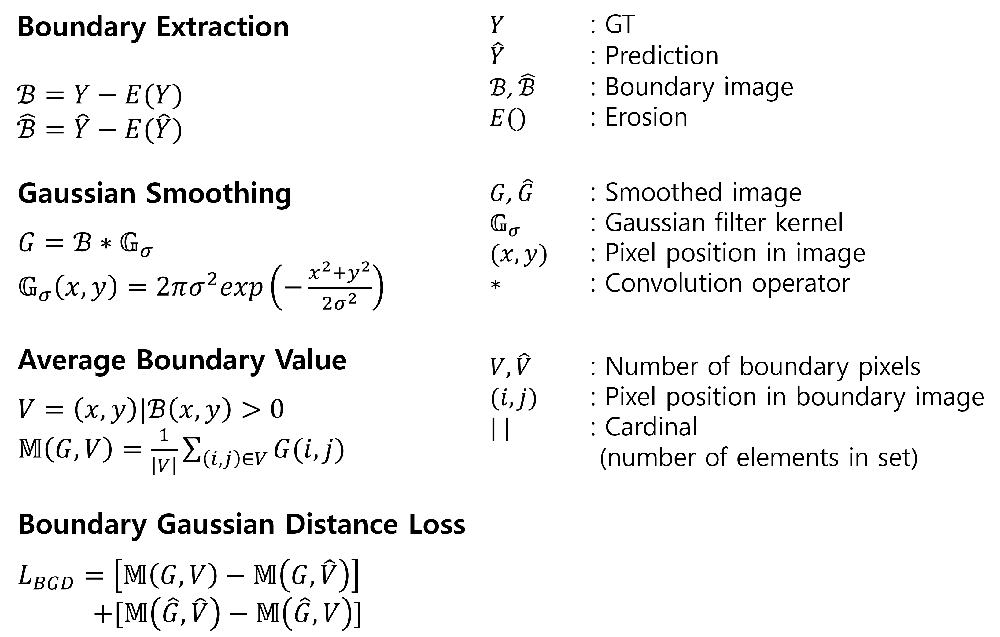
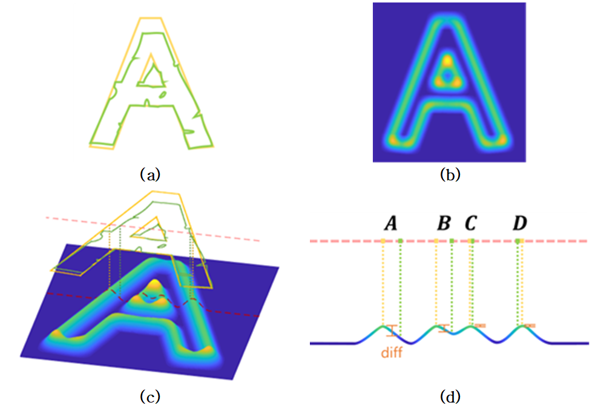
 
1. Get boundary image with Erosion. (a) 
2. Blur the boundary image with Gaussian kernel. (b) 
3. Calc M value: Average of Gaussian value on baundary position. (c,d) 
4. Calc difference between 4 different M. 
 
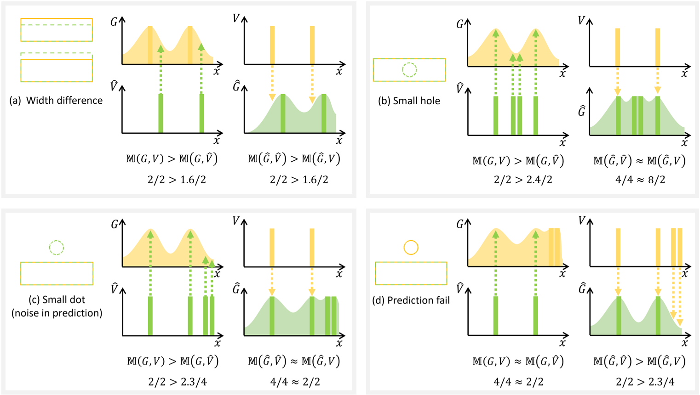
 
Each graph shows certical cross-section of results. 
The pixel value in boundary position is 1 and maximum Gaussian value has set as 1 via normalization. 
And we set other smaller values arbitrarily.

## Parameter

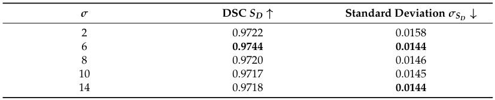

 
The performance of the proposed loss function is influenced by the Gaussian kernel parameter σ. 
Standard deviation σ controls the spatial range of boundary interaction. 
In character segmentation tasks, approximately half of the average stroke width provides the best trade-off between boundary smoothness and localization.

## Outlier Robustness

 
(a) ∂G/∂x of the Gaussian kernel 
(b) ∂G/∂x of the Gaussian kernel at y = 0 
 
The proposed loss function suppresses the influence of extreme outliers by relying on Gaussian-smoothed boundary responses rather than raw Euclidean distances. 
As a result, isolated noisy pixels or local GT errors do not dominate the loss value, leading to more stable optimization.

## Comparision with Hausdorff Distance Loss

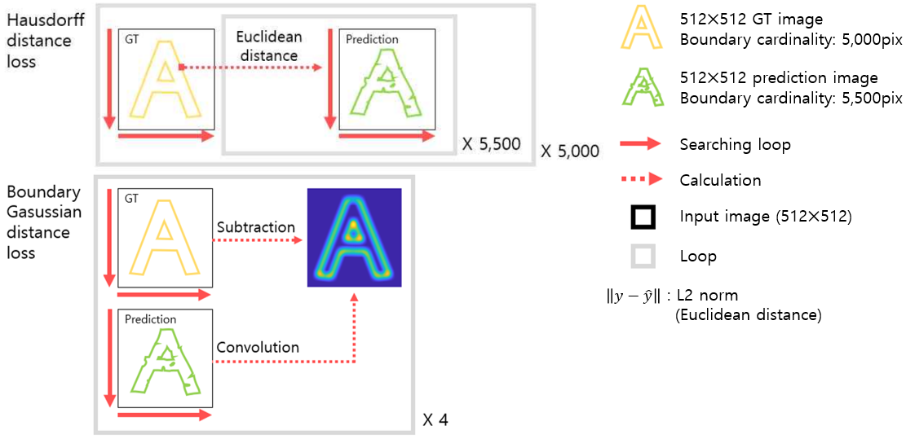
 
Although both methods measure boundary discrepancies, Hausdorff distance relies on brute-force nearest-neighbor search between boundary pixels, resulting in high computational cost and sensitivity to outliers. 
In contrast, the proposed method achieves similar boundary sensitivity with significantly lower computational complexity.

## Quantitative Evaluation

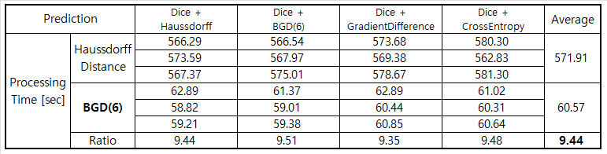
 
Quantitative results show that the proposed loss function consistently outperforms conventional region-based and boundary-based loss functions across multiple evaluation metrics. 
The improvements are especially noticeable in boundary-sensitive metrics under noisy document conditions.

## Qualitative Evaluation

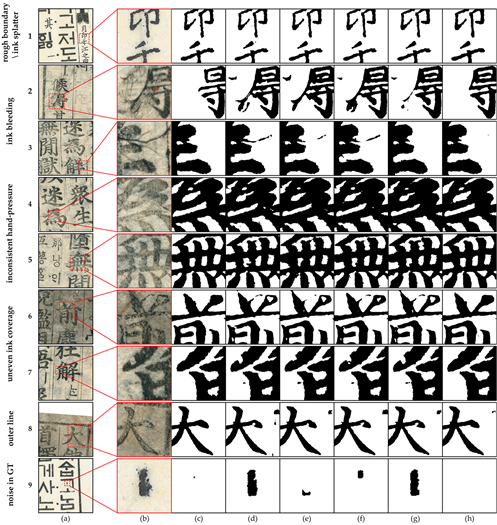
 
Qualitative comparisons demonstrate that the proposed method produces smoother and more coherent boundaries in challenging cases such as ink bleeding, broken strokes, and background noise. 
The predicted masks better preserve the overall character structure compared to baseline losses.

## Generalization

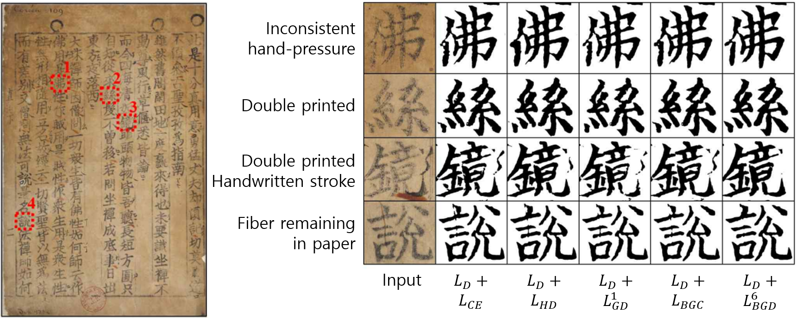
 
The model trained with the proposed loss function generalizes well to other historical documents that were not included in the training and validation set. 
According to the result, the model produces stable and visually consistent segmentation results, indicating practical applicability to real-world restoration scenarios.

